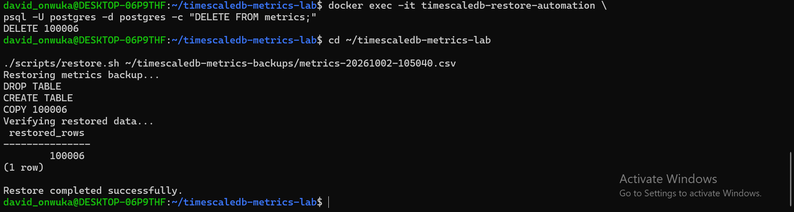

 # TimescaleDB Real-Time Metrics & Analytics Lab

A practical PostgreSQL and TimescaleDB operations lab focused on time-series data management, query performance, continuous aggregates, backup and restore, failure recovery, monitoring, automation, and operational runbooks.

The project uses *Tiger Data Cloud* as the primary PostgreSQL/TimescaleDB environment and a *disposable local TimescaleDB instance* for restore, failure-recovery, and monitoring experiments.

---

## Table of Contents

- [Project Objectives](#project-objectives)
- [Architecture](#architecture)
- [1. Database Setup](#1-database-setup)
- [2. TimescaleDB Hypertable](#2-timescaledb-hypertable)
- [3. Dataset Generation](#3-dataset-generation)
- [4. Time-Series Aggregation](#4-time-series-aggregation)
- [5. Continuous Aggregate](#5-continuous-aggregate)
- [6. Query Performance Analysis](#6-query-performance-analysis)
- [7. Performance Benchmark](#7-performance-benchmark)
- [8. Schema Migration](#8-schema-migration)
- [9. Database Monitoring](#9-database-monitoring)
- [10. Backup](#10-backup)
- [11. Restore Testing](#11-restore-testing)
- [12. Failure and Recovery Test](#12-failure-and-recovery-test)
- [13. Monitoring Stack](#13-monitoring-stack)
- [14. Automation Scripts](#14-automation-scripts)
- [15. Operations Runbook](#15-operations-runbook)
- [16. Repository Structure](#16-repository-structure)
- [17. Evidence](#17-evidence)
- [18. Key Technical Skills Demonstrated](#18-key-technical-skills-demonstrated)
- [19. Operational Lessons](#19-operational-lessons)
- [20. Project Outcome](#20-project-outcome)

---

## Project Objectives

This lab was built to demonstrate practical database operations skills including:

- PostgreSQL administration
- TimescaleDB hypertables and chunking
- Time-series data modelling
- Query optimization and performance analysis
- EXPLAIN (ANALYZE, BUFFERS)
- Time-based aggregation with time_bucket
- Continuous aggregates
- Schema migrations
- Backup and restore procedures
- Failure recovery
- Database health checks
- PostgreSQL monitoring with Prometheus
- Operational scripting
- Troubleshooting and incident recovery
- Documentation and database runbooks

---

## Architecture

text
                    Tiger Data Cloud
                           |
                           v
                PostgreSQL / TimescaleDB
                           |
                    metrics hypertable
                           |
             +-------------+-------------+
             |                           |
             v                           v
      Continuous Aggregate        Query Analysis
             |                           |
             v                           v
       Hourly Analytics          EXPLAIN ANALYZE
                                         |
                                         v
                                  Index Testing

        Backup / Recovery Testing
                    |
                    v
        Local TimescaleDB Container
                    |
          +---------+---------+
          |                   |
          v                   v
   Restore Testing      Failure Recovery
                              |
                              v
                    PostgreSQL Exporter
                              |
                              v
                         Prometheus

> The local TimescaleDB instance is intentionally disposable and is used for recovery, failure simulation, performance testing, and monitoring experiments.

---

## 1. Database Setup

| Setting     | Value                    |
|-------------|--------------------------|
| Engine      | PostgreSQL / TimescaleDB |
| Database    | tsdb                   |
| Environment | Tiger Data Cloud         |
| SSL         | Required                 |

### Metrics Table

sql
CREATE TABLE metrics (
    time TIMESTAMPTZ NOT NULL,
    host TEXT NOT NULL,
    cpu_usage DOUBLE PRECISION,
    memory_usage DOUBLE PRECISION,
    disk_usage DOUBLE PRECISION,
    network_mb DOUBLE PRECISION
);

The table stores server resource metrics including:

- CPU utilization
- Memory utilization
- Disk utilization
- Network traffic

---

## 2. TimescaleDB Hypertable

The metrics table was converted into a TimescaleDB hypertable:

sql
SELECT create_hypertable(
    'metrics',
    by_range('time'),
    migrate_data => true
);

The hypertable and its chunks were verified using TimescaleDB metadata views.

This provides time-oriented partitioning and allows TimescaleDB to manage the underlying chunks automatically.

---

## 3. Dataset Generation

A total of *100,006* metric records were generated across multiple servers (server-01 through server-10).

sql
INSERT INTO metrics (
    time,
    host,
    cpu_usage,
    memory_usage,
    disk_usage,
    network_mb
)
SELECT
    now() - (interval '1 minute' * n),
    'server-' || lpad(((n % 10) + 1)::text, 2, '0'),
    round((20 + random() * 70)::numeric, 2),
    round((40 + random() * 50)::numeric, 2),
    round((30 + random() * 60)::numeric, 2),
    round((10 + random() * 190)::numeric, 2)
FROM generate_series(1, 100000) AS n;

*Final dataset size:* 100,006 rows

---

## 4. Time-Series Aggregation

Hourly CPU utilization was calculated using TimescaleDB's time_bucket function:

sql
SELECT
    time_bucket('1 hour', time) AS hour,
    host,
    ROUND(AVG(cpu_usage)::numeric, 2) AS avg_cpu
FROM metrics
GROUP BY hour, host
ORDER BY hour, host
LIMIT 20;

This demonstrates time-series aggregation across hosts and hourly intervals.

---

## 5. Continuous Aggregate

Created a TimescaleDB continuous aggregate for hourly metrics:

sql
CREATE MATERIALIZED VIEW metrics_hourly
WITH (timescaledb.continuous) AS
SELECT
    time_bucket('1 hour', time) AS hour,
    host,
    AVG(cpu_usage) AS avg_cpu,
    AVG(memory_usage) AS avg_memory
FROM metrics
GROUP BY hour, host;

Verified the materialized results with:

sql
SELECT *
FROM metrics_hourly
ORDER BY hour DESC, host
LIMIT 10;

This demonstrates the use of continuous aggregates for repeatedly queried time-series summaries.

---

## 6. Query Performance Analysis

Query performance was investigated using EXPLAIN (ANALYZE, BUFFERS).

*Example workload:*

sql
SELECT time, host, cpu_usage
FROM metrics
WHERE time >= now() - INTERVAL '24 hours'
  AND host = 'server-01'
ORDER BY time DESC;

An index was created for host/time filtering:

sql
CREATE INDEX metrics_host_time_idx
ON metrics (host, time DESC);

The query plan was then inspected again to determine how PostgreSQL changed its execution strategy.

---

## 7. Performance Benchmark

A separate benchmark was run against the *local TimescaleDB restore environment* using a 30-day aggregation workload.

sql
EXPLAIN (ANALYZE, BUFFERS)
SELECT host,
       date_trunc('hour', time) AS hour,
       AVG(cpu_usage) AS avg_cpu,
       AVG(memory_usage) AS avg_memory,
       AVG(disk_usage) AS avg_disk
FROM metrics
WHERE time >= now() - INTERVAL '30 days'
GROUP BY host, hour
ORDER BY hour DESC, host;

### Baseline (sequential scan)

| Metric             | Value     |
|--------------------|-----------|
| Execution time     | 54.620 ms |
| Rows processed     | 42,097    |
| Rows filtered      | 57,909    |
| Shared buffers hit | 1,182     |
| Sort memory        | 4,168 kB  |

### Indexed Test

Added:

sql
CREATE INDEX metrics_time_host_idx
ON metrics (time DESC, host);

The query then used an index scan.

| Metric              | Value     |
|---------------------|-----------|
| Execution time      | 86.523 ms |
| Rows processed      | 42,095    |
| Shared buffers hit  | 485       |
| Shared buffers read | 210       |
| Sort memory         | 4,167 kB  |

### Finding

The index *did not improve* this particular workload. The query accessed a large proportion of the table, making the original sequential scan faster than the indexed access path.

> *An index is not automatically an optimization. Query selectivity and workload characteristics must be measured.*

Performance changes were therefore validated using EXPLAIN (ANALYZE, BUFFERS) before and after the change.

Detailed results: [benchmarks/performance-results.md](benchmarks/performance-results.md)

---

## 8. Schema Migration

The metrics table was extended with a region column:

sql
ALTER TABLE metrics
ADD COLUMN region TEXT;

Existing rows were migrated:

sql
UPDATE metrics
SET region =
    CASE
        WHEN host LIKE 'server-0%' THEN 'us-east'
        ELSE 'eu-west'
    END;

*Migration results:*

| Region      | Rows        |
|-------------|-------------|
| us-east     | 90,006      |
| eu-west     | 10,000      |
| *Total*   | *100,006* |

The migration demonstrates modifying an existing production-style dataset while preserving the existing records.

---

## 9. Database Monitoring

PostgreSQL database activity was inspected using system views.

### Database-level monitoring

sql
SELECT
    datname,
    numbackends AS active_connections,
    pg_size_pretty(pg_database_size(datname)) AS database_size
FROM pg_stat_database
WHERE datname = current_database();

Observed during testing:

| Database | Active connections | Database size |
|----------|--------------------|---------------|
| tsdb   | 3                  | 43 MB         |

### Active query monitoring

sql
SELECT
    pid,
    usename,
    state,
    EXTRACT(
        EPOCH FROM (clock_timestamp() - query_start)
    )::int AS query_seconds,
    LEFT(query, 80) AS query
FROM pg_stat_activity
WHERE datname = current_database()
ORDER BY query_start DESC;

This was used to inspect active sessions and running queries.

---

## 10. Backup

A PostgreSQL custom-format backup was created using pg_dump:

bash
pg_dump -Fc "postgres://tsdbadmin@HOST:PORT/tsdb?sslmode=require" \
    -f ~/timescaledb-metrics-lab.backup

The backup completed successfully.

A separate operational CSV export script was also created: [scripts/backup.sh](scripts/backup.sh)

The script exports the complete metrics dataset, including the migrated region column.

text
COPY 100006

*Backup output location:* ~/timescaledb-metrics-backups/

---

## 11. Restore Testing

A disposable local TimescaleDB container was used to test restoration. The PostgreSQL custom-format backup was restored using pg_restore.

The restored environment was verified for:

- Table existence
- Hypertable existence
- Row count
- Data accessibility

Final verification:

text
restored_rows = 100006

The restore test confirmed that the database could be recovered into a separate environment.

---

## 12. Failure and Recovery Test

A controlled failure was simulated against the disposable local restore database.

The metrics dataset was deleted:

sql
DELETE FROM metrics;

text
DELETE 100006

The automated restore procedure was then executed:

bash
./scripts/restore.sh \
    ~/timescaledb-metrics-backups/metrics-20261002-105040.csv

The restore completed successfully:

text
COPY 100006

Verification:

text
restored_rows
-------------
100006

This demonstrated a complete recovery cycle:

text
Failure → Diagnosis → Restore → Verification → Recovery confirmed

*Evidence:* timescaledb-failure-recovery-success.png

---

## 13. Monitoring Stack

A lightweight local monitoring stack was configured using:

- PostgreSQL Exporter
- Prometheus

The PostgreSQL exporter exposes database metrics on http://localhost:9187/metrics.

Health was verified using:

bash
curl http://localhost:9187/metrics | grep pg_up

Expected result:

text
pg_up 1

Prometheus runs on http://localhost:9090.

> Grafana was evaluated during the project but intentionally excluded from the final lightweight monitoring setup.

---

## 14. Automation Scripts

The project contains operational scripts for common database tasks.

| Script                    | Purpose                                                                                            |
|---------------------------|----------------------------------------------------------------------------------------------------|
| scripts/health-check.sh | Checks PostgreSQL connectivity. Example output: Database health check: OK                       |
| scripts/backup.sh       | Exports the metrics dataset to a timestamped CSV backup.                                           |
| scripts/restore.sh      | Restores a CSV backup into the disposable local PostgreSQL environment and verifies the row count. |

*Restore usage:*

bash
./scripts/restore.sh /path/to/backup.csv

---

## 15. Operations Runbook

Operational procedures are documented in [docs/runbooks/operations.md](docs/runbooks/operations.md).

The runbook covers:

- Database health checks
- Backup procedures
- Restore procedures
- Slow-query investigation
- Monitoring
- Recovery principles

The operational approach emphasizes:

text
Diagnose → Protect valid backups → Apply controlled recovery → Verify → Document

---

## 16. Repository Structure

text
timescaledb-metrics-lab/
│
├── README.md
│
├── benchmarks/
│   └── performance-results.md
│
├── docs/
│   └── runbooks/
│       └── operations.md
│
├── monitoring/
│   ├── docker-compose.yml
│   └── prometheus.yml
│
├── scripts/
│   ├── backup.sh
│   ├── health-check.sh
│   └── restore.sh
│
├── timescaledb-backup-restore-success.png
├── timescaledb-continuous-aggregate.png
├── timescaledb-monitoring-overview.png
├── timescaledb-schema-migration.png
├── timescaledb-failure-recovery-success.png
└── timescaledb-monitoring-stack.png

---

## 17. Evidence

| Area                 | Screenshot                                                                |
|----------------------|---------------------------------------------------------------------------|
| Backup and Restore   | timescaledb-backup-restore-success.png                                  |
| Continuous Aggregate | timescaledb-continuous-aggregate.png                                    |
| Schema Migration     | timescaledb-schema-migration.png                                        |
| Monitoring           | timescaledb-monitoring-overview.png, timescaledb-monitoring-stack.png |
| Failure Recovery     | timescaledb-failure-recovery-success.png                                |

---

## 18. Key Technical Skills Demonstrated

### PostgreSQL

- SQL
- Tables and schemas
- Indexes
- Aggregations
- System catalog views
- pg_stat_activity
- pg_stat_database
- pg_dump
- pg_restore
- EXPLAIN / EXPLAIN ANALYZE
- Buffer analysis

### TimescaleDB

- Hypertables
- Time-based partitioning
- Chunks
- time_bucket
- Continuous aggregates
- Time-series workloads

### Database Operations

- Backup
- Restore
- Failure recovery
- Schema migration
- Health checks
- Query troubleshooting
- Performance benchmarking
- Monitoring

### DevOps / Automation

- Bash scripting
- Docker
- Docker Compose
- Prometheus
- PostgreSQL Exporter
- Git
- GitHub
- Operational documentation

---

## 19. Operational Lessons

*Measure before optimizing.* An index can change a query plan without improving performance. Always validate changes using EXPLAIN (ANALYZE, BUFFERS).

*Recovery must be tested.* A backup should not simply exist; restoration should be tested and verified.

*Disposable environments are useful.* A local disposable database provides a safe space for:

- Restore testing
- Failure simulation
- Performance experiments
- Monitoring configuration

*Verification is part of recovery.* A restore is not considered successful until the recovered data has been verified.

*Monitoring should be actionable.* Database monitoring should provide enough information to identify:

- Availability problems
- Connection pressure
- Active queries
- Query duration
- Database health

---

## 20. Project Outcome

This project provides a practical demonstration of *operating* a PostgreSQL/TimescaleDB environment rather than only writing SQL queries.

The lab covers the complete operational lifecycle:

text
Provision → Model time-series data → Load data → Aggregate → Optimize
→ Migrate schema → Back up → Monitor → Simulate failure → Restore
→ Verify recovery → Document operations

The project is designed as a portfolio demonstration of PostgreSQL, TimescaleDB, database support, troubleshooting, performance analysis, backup/recovery, monitoring, and DevOps automation.

---

## Repository

GitHub: [david-onwuka/timescaledb-metrics-lab](https://github.com/david-onwuka/timescaledb-metrics-lab)
